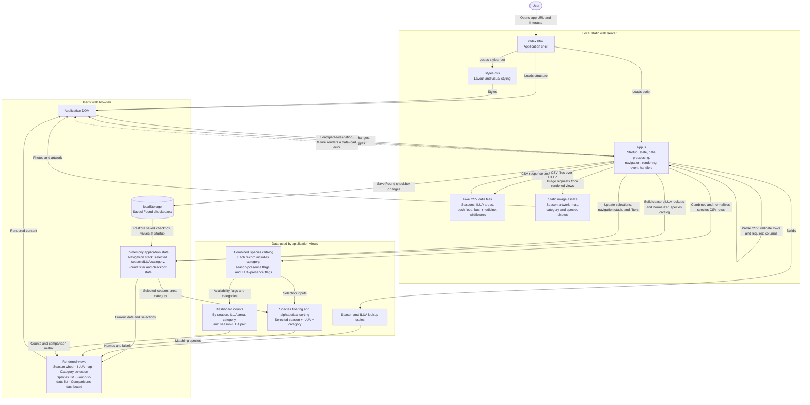

# Application architecture

The diagram below describes the current application. It is written in Mermaid so
the diagram can be edited as text in this file and rendered by Mermaid-compatible
editors and viewers.

## Data and behavior notes

- `app.js` requests the five CSV files when the page starts. It parses and
  validates them, then prepares lookup tables and a combined species catalog.
- The season wheel, ILUA selection, category selection, species views, and
  comparison dashboard are rendered in the browser from that data.
- A species may be recorded in multiple seasons and ILUA areas. Therefore,
  dashboard counts for those groups overlap and should not be summed as a
  distinct-species total.
- Found checkbox values are saved in browser `localStorage` on the current
  device. CSV data and image assets are served as static files; there is no
  application backend or remote database.
